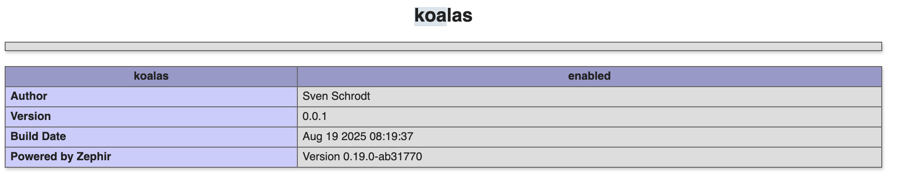

## Building and installaing extension

```sh
sven@Thanos koalas % zephir build

Compiling...
 Zephir version [...]
 Installing...
Extension installed.
Add "extension=koalas.so" to your php.ini
Don't forget to restart your web server

svenschrodt@Thanos doq % php -m              
[PHP Modules]
...
koalas
...

```

### phpinfo()

